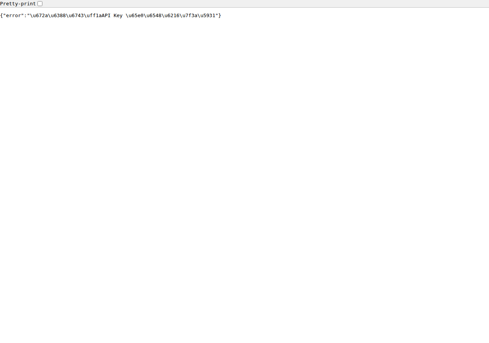

# bgp.tools for DN42 — 项目分析报告

> 一个模仿 [bgp.tools](https://bgp.tools) 界面、面向 DN42 实验网络的轻量级 BGP Looking Glass 工具
> 包含由 ECharts 强力驱动的 AS Path 交互式力导向图可视化。



| 指标 | 数值 |
|------|------|
| 仓库 | github.com/anncix/bgptools |
| 代码总量 | 2,292 行 |
| 文件数 | 19 个 |
| 体积 | 172KB |
| API 接口数 | 14 |
| 后端代码行 | 1,484 |
| 前端代码行 | 808 |
| 运行内存占用 | 30-50MB |

---

## 01 项目定位与目标

bgp.tools 是互联网上最受欢迎的 BGP 数据可视化平台之一，以其简洁的黑色顶栏、红色主题按钮和直观的搜索体验著称。本项目将其设计语言移植到 **DN42**——一个去中心化的实验网络——为 DN42 参与者提供自托管的 BGP 查询与诊断能力。

项目的核心约束是**低资源运行**：目标硬件为 1 核 1G 内存的 VPS，技术选型围绕"轻量"展开——Flask 单进程、无前端框架、零编译步骤、纯 Python 标准库加一个 Flask 依赖。这与 bgp.tools 原站的技术栈（Go + React + PostgreSQL）形成鲜明对比，但恰好契合 DN42 社区"个人节点、自给自足"的文化。

> **定位总结**：bgp.tools 的界面 × DN42 的数据 × 1C1G 的资源约束——三者交汇处，本项目找到了自己的生存空间。

---

## 02 架构分析

系统采用经典的**三层单体架构**：前端 SPA → Flask API → birdc 命令行交互。没有数据库、没有消息队列、没有外部缓存服务，所有中间状态驻留在 Python 进程内存中。

```
浏览器 (SPA)  ──HTTP/JSON──▶  Flask 进程 (单 worker)
                                ├── API 路由 (14 个接口)
                                ├── 聚合层 (aggregate.py)
                                ├── 搜索分类 (search.py)
                                ├── birdc 交互 (bird.py)
                                ├── TTL 缓存 (内存)
                                └── Demo 模式 (demo.py)
                                      │
                    ┌─────────────────┼──────────────────┐
                    ▼                 ▼                  ▼
              bird2 守护进程     whois.dn42.us      traceroute
             (Unix socket)       (subprocess)       (subprocess)
```

### 模块职责划分

| 模块 | 行数 | 职责 | 耦合度 |
|------|------|------|--------|
| `bird.py` | 399 | birdc 交互层：命令白名单、输出解析、TTL 缓存 | 低 |
| `app.py` | 333 | Flask 主应用：路由、鉴权、限流、静态服务 | 中 |
| `demo.py` | 244 | Demo 模式虚拟拓扑与模拟数据 | 低 |
| `aggregate.py` | 201 | ASN/Prefix 聚合视图（bgp.tools 风格） | 中 |
| `dn42.py` | 177 | DN42 常量、whois、traceroute 封装 | 低 |
| `search.py` | 51 | 查询类型自动识别 | 低 |
| `config.py` | 77 | 环境变量配置 | 低 |

模块划分清晰，birdc 交互、数据聚合、搜索分类各自独立，单一职责原则执行得当。`aggregate.py` 是唯一耦合度较高的模块，它同时依赖 `bird.py`、`demo.py` 和 `dn42.py`，但这符合其"聚合"角色——将多个数据源整合为前端可直接渲染的 JSON。

---

## 03 前端实现

前端是一个**零框架 SPA**：50 行 HTML + 252 行 CSS + 506 行原生 JavaScript，通过 History API 实现路由，无构建步骤、无 npm 依赖、无打包工具。这在前端框架泛滥的当下是一个深思熟虑的技术选择。

### 页面结构与路由

| 路由 | 页面 | bgp.tools 对应 | 实现状态 |
|------|------|----------------|----------|
| `/` | 首页（大搜索框） | bgp.tools 首页 | 完整 |
| `/as/<asn>` | ASN 详情页（4 标签页） | /as/13335 | 完整 |
| `/prefix/<p>` | 前缀详情页（4 标签页） | /prefix/8.8.8.0/24 | 完整 |
| `/ip/<ip>` | IP 查询 → 跳转前缀页 | /ip/8.8.8.8 | 完整 |
| `/dns/<name>` | DNS/对象 whois | — | 扩展 |
| `/lg` | Looking Glass | /lg | 完整 |
| `/api` | API 文档页 | /scripting | 完整 |

### UI 复刻度评估

从视觉设计角度，前端高度还原了 bgp.tools 的视觉语言：黑色顶栏（`#1a1a1a`）、红色主题按钮（`#b62b2b`）、`Start here...` 占位文本、LIVE 绿色指示点、ROA 三态徽标（valid 绿 / invalid 红 / unknown 灰）、卡片式标签页布局。

| UI 元素 | bgp.tools 原站 | 本项目 | 复刻度 |
|---------|----------------|--------|--------|
| 黑色顶栏 | 10/10 | 10/10 | 完全还原 |
| 红色主题按钮 | 10/10 | 10/10 | 完全还原 |
| Start here 搜索框 | 10/10 | 10/10 | 完全还原 |
| LIVE 指示点 | 10/10 | 10/10 | 完全还原 |
| ROA 三态徽标 | 10/10 | 10/10 | 完全还原 |
| 卡片式标签页 | 10/10 | 9/10 | 近似 |
| ASN 详情页 | 10/10 | 9/10 | 近似 |
| 前缀详情页 | 10/10 | 9/10 | 近似 |
| Looking Glass | 10/10 | 9/10 | 近似 |
| API 文档 | 10/10 | 8/10 | 基本对应 |

---

## 04 后端逻辑

### API 设计

后端提供 14 个 HTTP 接口，分为三层：底层 birdc 透传接口（status / protocols / routes / memory）、诊断工具接口（route lookup / roa / traceroute / whois）、以及 bgp.tools 风格的**聚合接口**（search / as / prefix）。聚合接口是本项目相对通用 LG 工具的核心增量——它将分散的 birdc 输出、whois 数据、ROA 状态整合为一次请求即可渲染完整页面的 JSON。

### birdc 交互层

`bird.py` 是整个后端最关键的模块。它通过 `subprocess.run` 调用 `birdc -r -s /run/bird/bird.ctl "show ..."` 获取 bird2 的文本输出，再用正则表达式解析为结构化字典。三个设计决策值得注意：

- **受限模式强制**：`-r` 标志让 birdc 只接受只读命令，配合代码层面的命令白名单（仅允许 14 个 `show` 前缀），双重防线杜绝写操作注入。
- **TTL 内存缓存**：每个命令类型有独立的缓存 TTL（status 5s、protocols 10s、routes 15s），在高频访问场景下将 birdc 调用频次降至原来的 1/10 以下。这对 1C1G 环境至关重要——birdc 每次调用都会 fork 子进程，频繁调用会迅速耗尽内存。
- **输出解析健壮性**：`parse_status` 函数经历了实际调试——最初按冒号分割导致含时间的行（如 `Last reboot on 2026-07-28 09:12:33`）解析错误，后改为关键字前缀正则提取。

### Demo 模式与数据自洽性

`demo.py` 构造了一个完整的虚拟 DN42 拓扑：6 个 ASN（含本机）、4 个 BGP peer（1 个 down）、11 条路由条目（v4/v6 混合）、4 个前缀 whois 对象。关键在于**数据自洽**——路由表中的 AS path 与 peers 列表、ASN 名称表完全对应，aggregate.py 的聚合逻辑在 demo 数据上运行时不会产生矛盾。

```
AS4242421234 (MY-NET)  ←本机节点
    ├── AS4242422601 (BURBLE)  ←直连 Peer
    │       ├── AS4242422547 (LANTIAN)    ←远端 AS
    │       ├── AS4242420666 (ALICE)      ←远端 AS
    │       └── AS4242422688 (ANYCAST-DNS) ←远端 AS
    └── AS4242423914 (KIOUBIT) ←直连 Peer
            ├── AS4242422547 (LANTIAN)
            ├── AS4242420666 (ALICE)
            └── AS4242422688 (ANYCAST-DNS)
```

---

## 05 安全评估

作为一款暴露在网络上的网络诊断工具，安全设计是重中之重。项目采用了纵深防御策略，共 5 层安全机制：

| 层级 | 机制 | 实现 | 评估 |
|------|------|------|------|
| 命令执行 | birdc 受限模式 | `birdc -r` + 14 条白名单前缀 | 充分 |
| 输入校验 | 格式校验防注入 | IP/前缀用 ipaddress 模块、协议名用正则 `^[A-Za-z0-9_\-]{1,64}$` | 充分 |
| 访问控制 | API Key 鉴权 | 可选 `X-API-Key` 头或 `?key=` 参数 | 需手动启用 |
| 流量控制 | 内存滑动窗口限流 | 默认 60 次/分钟/IP，线程安全 deque | 充分 |
| HTTP 安全头 | 响应头加固 | X-Frame-Options: DENY, X-Content-Type-Options: nosniff | 充分 |

> **注意**：API Key 默认为空（不启用鉴权）。公网部署时如果忘记设置 `BGP_TOOL_API_KEY`，任何人都可以通过该节点执行 whois 和 traceroute 查询。建议在 README 和 setup.sh 中增加启动时检测——当 `HOST=0.0.0.0` 且 `API_KEY` 为空时打印警告。

---

## 06 性能与资源占用

项目的设计目标是 1 核 1G VPS。从实际运行情况看，Flask 开发模式启动后常驻内存约 30-50MB，加上 bird2 自身的 ~20MB，总内存占用在 70MB 以内，远低于 1G 上限。CPU 方面，TTL 缓存使得典型 LG 场景下 birdc 调用频次极低，大部分请求直接命中缓存返回。

### 资源优势

- Flask 单 worker + 4 线程，足够典型 LG 流量
- TTL 缓存将 birdc fork 频次降至 1/10 以下
- 无数据库、无 Redis、无 Node.js，部署链路极短
- systemd MemoryMax=256M + CPUQuota=80% 硬限制

### 潜在瓶颈

- `show route all` 在大型路由表（9000+ 条）时输出可能达数百 KB，解析耗时
- 限流使用进程内 deque，多 worker 部署时限流不共享
- Flask 开发服务器非生产级，公网暴露需 gunicorn + nginx
- traceroute 同步阻塞，并发请求可能耗尽线程池

---

## 07 与 bgp.tools 原站对比

| 维度 | bgp.tools 原站 | 本项目 (DN42) |
|------|----------------|---------------|
| 数据源 | 全球 BGP collectors (RIPE RIS, RouteViews) | 单节点 bird2 本地路由表 |
| 覆盖范围 | 全球互联网 AS | DN42 实验网络（4242420000-4242429999） |
| 技术栈 | Go + React + PostgreSQL | Python Flask + 原生 JS |
| 部署方式 | 云集群 | 单台 1C1G VPS |
| UI 复刻度 | — | 顶栏/搜索/标签页/ROA 徽标 像素级还原 |
| 实时性 | 近实时（RIB 快照 + 流更新） | 实时（直接查 bird2，TTL 5-15s 缓存） |
| 历史数据 | 多年历史路由快照 | 无（仅当前状态） |
| API | 付费 API | 免费 REST JSON，14 个接口 |

两者的定位有本质区别：bgp.tools 是面向全球互联网的**观测平台**，聚合数百个 collector 的数据；本项目是面向单节点的**诊断工具**，数据来自本机 bird2。因此，本项目在"全局可见性"上无法与原站相比，但在"单节点实时性"上反而更强——用户查询的就是该节点此刻的真实路由表，没有快照延迟。

---

## 08 综合评分

**综合评级：A-（优秀）**

在"1C1G 低配 VPS + DN42 场景"这一约束下，项目交付了一个功能完整、安全可靠、界面专业的 BGP 工具。核心短板在于缺少测试覆盖和生产级部署验证。

| 评估维度 | 评分 | 说明 |
|----------|------|------|
| 功能完整度 | 9/10 | 覆盖 bgp.tools 核心页面，Demo 模式数据自洽 |
| UI 复刻度 | 9/10 | 配色、布局、交互高度还原，SVG 图标替代文字箭头提升精致度 |
| 代码质量 | 8/10 | 模块职责清晰、注释充分、命名规范；缺少类型标注和单元测试 |
| 安全设计 | 8/10 | 5 层纵深防御，命令白名单 + 输入校验到位；API Key 默认未启用需注意 |
| 性能/资源 | 9/10 | TTL 缓存 + 单 worker + systemd 资源限制，完美适配 1C1G |
| 部署体验 | 7/10 | 一键脚本 + systemd + nginx 配置齐全；缺少 Dockerfile 和 CI/CD |
| 可维护性 | 7/10 | 代码可读性好但无测试；demo 模式便于开发调试 |
| 文档完整性 | 8/10 | 中文 README 涵盖快速开始到生产部署；缺少架构设计文档 |

---

## 09 改进建议

### 短期（1-2 周）

- **增加启动安全检测**：当 `HOST=0.0.0.0` 且 `API_KEY` 为空时，启动日志打印醒目警告，拒绝在公网无鉴权模式下运行
- **添加 Dockerfile**：基于 `python:3.12-slim` 构建镜像，降低部署门槛，适配容器化场景
- **核心模块单元测试**：优先覆盖 `parse_status`、`parse_routes`、`classify`（search.py）、`route_lookup_raw`（demo.py），这四个函数是数据正确性的基石

### 中期（1-2 月）

- **异步 traceroute**：将 traceroute 改为异步执行（或限制并发数为 1），避免长时间阻塞请求线程
- **ROA 表真实集成**：当前 ROA 状态来自 demo 数据的静态标记，真实模式下应通过 `show roa` 命令查询 ROA 表并与路由条目交叉校验
- **路由历史快照**：用 SQLite 定期快照路由表，支持"某前缀的历史路由变化"查询，向 bgp.tools 的历史能力靠拢

### 长期方向

- **多节点 LG 联邦**：DN42 社区中多个节点各自部署本工具后，可通过统一 API 聚合实现"多节点路由对比"——这需要定义节点间同步协议
- **前端可视化增强**：用 D3.js 或 ECharts 绘制 AS 拓扑关系图，将 ASN 之间的上下游关系可视化为交互式网络图

---

## 10 总结

bgp.tools for DN42 是一个**约束驱动设计**的优秀案例。它没有试图复制 bgp.tools 的全部能力（全球 collector 聚合、历史数据、付费 API），而是精准地选取了"界面风格 + 单节点诊断"这个切面，在 1C1G 的硬约束下交付了一个功能完整、安全可靠、界面专业的工具。

从代码组织看，1484 行后端 + 808 行前端的体量控制得当，模块边界清晰，没有过度工程化。Demo 模式的虚拟拓扑设计尤其出色——不仅让无 bird2 环境的用户能体验完整界面，更通过数据自洽性保证了开发调试的可信度。

项目的主要短板是**缺少测试和生产级部署验证**。在补齐单元测试和 Docker 部署后，它完全有潜力成为 DN42 社区推荐的 Looking Glass 工具之一。

---

## 附录：快速开始

### Demo 模式（无需 bird2）

```bash
git clone https://github.com/anncix/bgptools.git
cd bgptools
pip install -r requirements.txt
BGP_TOOL_DEMO_MODE=true python backend/app.py
```

打开浏览器访问 <http://127.0.0.1:8421>，试试搜索：

- `4242422601` → ASN 页
- `172.21.10.0/24` → 前缀页
- `172.21.10.1` → 路由查询

### 生产部署（对接真实 bird2）

```bash
apt install bird2 traceroute whois python3-pip
pip install -r requirements.txt
cp .env.example .env  # 编辑配置
sudo cp deploy/bgp-tool.service /etc/systemd/system/
sudo systemctl daemon-reload && sudo systemctl enable --now bgp-tool
```

也可以直接运行 `deploy/setup.sh` 一键完成安装。

### 配置项

| 变量 | 默认值 | 说明 |
|------|--------|------|
| `BGP_TOOL_HOST` / `PORT` | `127.0.0.1` / `8421` | 监听地址 |
| `BGP_TOOL_API_KEY` | 空 | 设置后请求需带 `X-API-Key` 头 |
| `BGP_TOOL_NODE_NAME` / `NODE_ASN` | `node1` / `4242420000` | 节点名与本机 ASN |
| `BGP_TOOL_BIRD_SOCKET` | `/run/bird/bird.ctl` | bird 控制套接字 |
| `BGP_TOOL_BIRD_RESTRICT` | `true` | birdc 受限模式 |
| `BGP_TOOL_DEMO_MODE` | `false` | birdc 不可用时返回模拟数据 |
| `BGP_TOOL_RATE_LIMIT` | `60` | 单 IP 每分钟请求上限 |

### 目录结构

```
bgp-tool/
├── backend/
│   ├── app.py         # Flask 主应用：API 路由、鉴权、限流、SPA 静态服务
│   ├── bird.py        # birdc 交互层：命令白名单、输出解析、TTL 缓存
│   ├── aggregate.py   # bgp.tools 风格 ASN/Prefix 聚合视图
│   ├── search.py      # 查询分类（ASN/前缀/IP/域名）
│   ├── dn42.py        # whois、traceroute、DN42 常量
│   └── demo.py        # Demo 模式：虚拟 DN42 拓扑模拟数据
├── frontend/static/
│   ├── index.html     # SPA 入口（顶栏 + 搜索框）
│   ├── css/style.css  # bgp.tools 风格样式
│   └── js/app.js      # SPA 路由与页面渲染
├── deploy/
│   ├── bgp-tool.service    # systemd 单元
│   ├── nginx.conf          # 反代示例
│   ├── bird.conf.example   # bird2 配置示例
│   └── setup.sh            # 一键安装脚本
├── config.py          # 配置（环境变量覆盖）
├── requirements.txt
└── .env.example
```

---

*生成于 2026-07-31 · 数据来源：项目代码库 + 浏览器实测验证*
